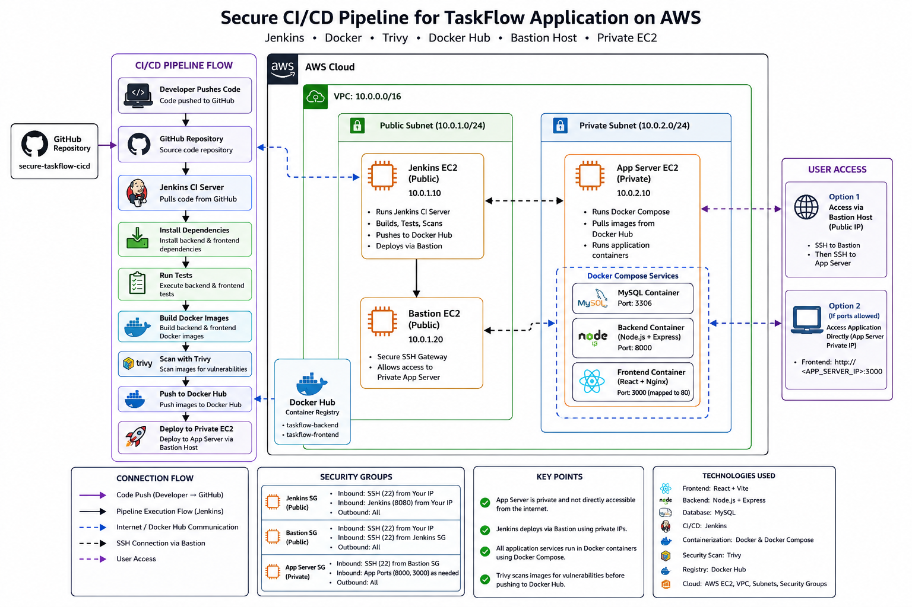

# Secure CI/CD Pipeline for TaskFlow on AWS

---

TaskFlow is a simple full-stack task management application deployed using a secure CI/CD pipeline with Jenkins, Docker, Trivy, Docker Hub, and AWS EC2.

## Project Overview

This project demonstrates how to automate the software delivery process using Jenkins hosted on AWS. The pipeline fetches code from GitHub, installs dependencies, runs tests, builds Docker images, scans images for vulnerabilities using Trivy, pushes images to Docker Hub, and deploys the application to an EC2 instance.

## Tech Stack

- React
- Node.js
- Express.js
- MySQL
- Docker
- Docker Compose
- Jenkins
- Trivy
- Docker Hub
- AWS EC2
- AWS VPC
- Public and Private Subnets
- Bastion Host
- Security Groups

## Features

- User registration and login
- JWT authentication
- Create tasks
- View tasks
- Mark tasks as completed
- Delete tasks
- Dockerized frontend and backend
- Automated CI/CD pipeline
- Vulnerability scanning before deployment
- Secure AWS network design

## CI/CD Workflow

1. Developer pushes code to GitHub
2. GitHub webhook triggers Jenkins
3. Jenkins fetches the latest code
4. Jenkins installs dependencies
5. Jenkins runs tests
6. Jenkins builds Docker images
7. Trivy scans Docker images for vulnerabilities
8. Jenkins pushes images to Docker Hub
9. Jenkins deploys the application to AWS EC2

## AWS Architecture

- Jenkins runs on an EC2 instance in a public subnet
- Bastion host provides controlled SSH access
- Application server runs in a private subnet
- VPC, route tables, internet gateway, NAT gateway, and security groups are used to manage networking and security

## What I Learned

- How to build a complete CI/CD pipeline
- How to use Jenkins pipelines
- How to containerize applications with Docker
- How to scan Docker images using Trivy
- How to push images to Docker Hub
- How to deploy applications on AWS EC2
- How to design a secure AWS network using public and private subnets