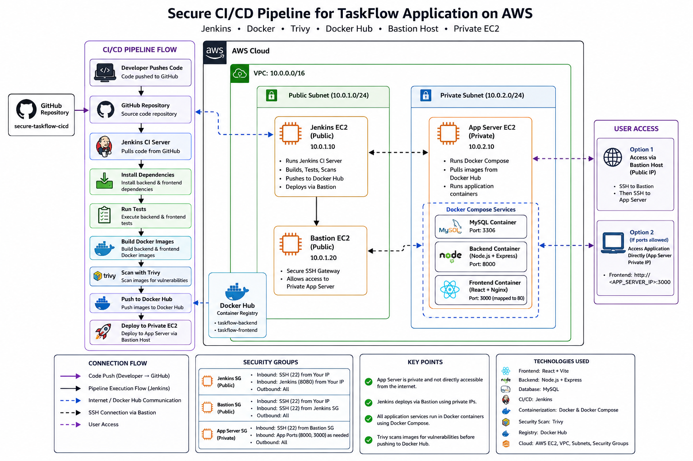

# TaskFlow — Secure AWS CI/CD Deployment

<p align="center">
  
</p>

<p align="center">
  <strong>A full-stack task management application deployed on AWS using a secure CI/CD pipeline with Jenkins, Docker, Trivy, and AWS EC2.</strong>
</p>

<p align="center">
  <a href="https://github.com/LuthiraPeiris/secure-taskflow-cicd">
    
  </a>
  
  
  
</p>

---

## 📌 Project Overview

**TaskFlow** is a full-stack task management application developed to explore and implement a practical **AWS-based DevOps deployment workflow**.

The project focuses on more than application development. It demonstrates how a software application can be:

- Containerized using Docker
- Automatically built through Jenkins
- Security-scanned using Trivy
- Published as Docker images
- Deployed to a private EC2 environment
- Hosted inside an AWS VPC with network segmentation
- Accessed through a controlled network architecture

The project was built as a practical learning exercise around **AWS infrastructure, CI/CD, containerization, Linux administration, networking, and DevSecOps concepts**.

---

# 🏗️ Architecture

The deployment uses a custom AWS VPC with separate public and private network layers.

```text
                         Internet
                            │
                            ▼
                     ┌──────────────┐
                     │ Internet GW  │
                     └──────┬───────┘
                            │
                 ┌──────────┴──────────┐
                 │                     │
                 ▼                     ▼
        ┌─────────────────┐    ┌─────────────────┐
        │  Jenkins EC2    │    │   Bastion Host  │
        │  Public Subnet  │    │  Public Subnet  │
        └────────┬────────┘    └────────┬────────┘
                 │                      │
                 │                      │ SSH
                 │                      ▼
                 │             ┌─────────────────┐
                 │             │ Application EC2 │
                 └────────────►│ Private Subnet  │
                               │                 │
                               │ Docker           │
                               │ ├── Frontend    │
                               │ ├── Backend      │
                               │ └── MySQL        │
                               └─────────────────┘
                                        │
                                        ▼
                                  NAT Gateway
                                        │
                                        ▼
                                    Internet